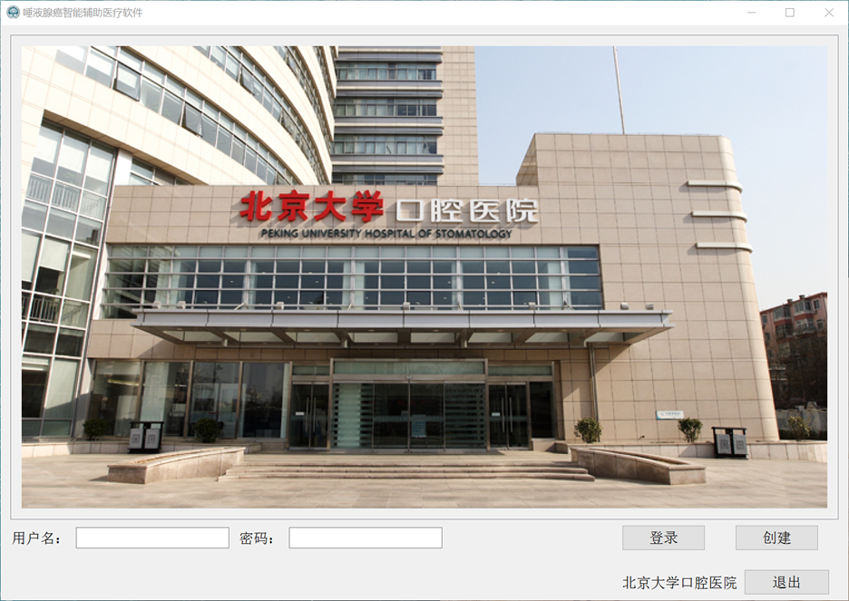
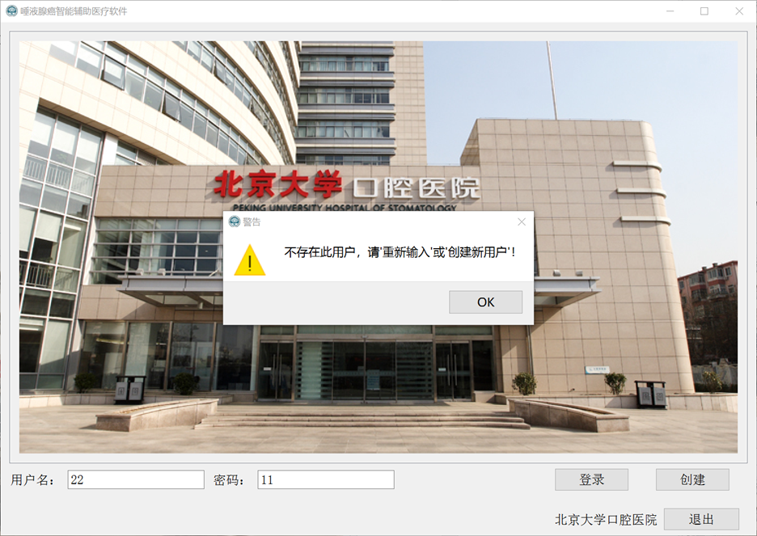
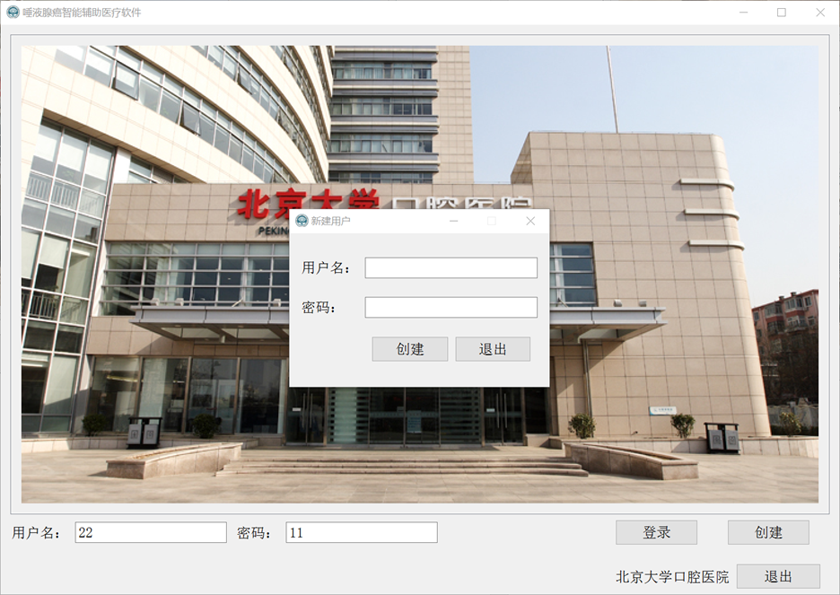
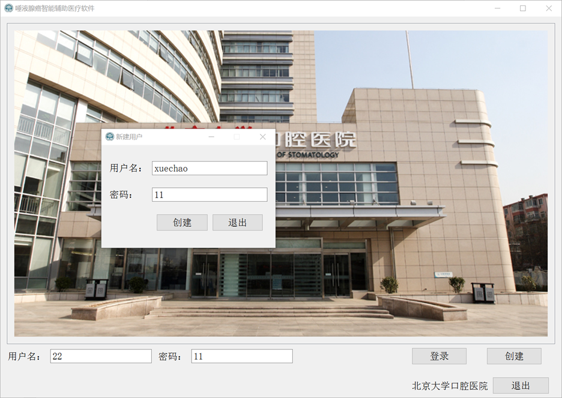

# Prognostic prediction model for salivary gland carcinoma based on machine learning
Intelligent Assisted Medical Software for Salivary Gland Cancer

## Login Interface
Operation Process: (Username is in English only)

Upon running the software, the login interface appears. Enter the username and corresponding password, then click 'Login' to access the main program.

If the entered username or password is incorrect, a warning dialog will appear, stating, "This user does not exist. Please re-enter or create a new user!"

To create a new user, click the "Create" button. A new window will appear, as follows. Enter the desired username and login password, click "Create," wait for the confirmation prompt, and then click "Exit" to return to the login interface for logging in again.

源码流程：
主程序GUI.py中GUI_Log类为调用登录界面，其中用户及密码以excel形式保存在“./GUI/data/user_info.csv”中。此时若需要创建新用户，则调用GUI_Create_Account类。

主界面
包含“历史数据分析”界面、“影响因素分析”界面、“智能算法训练”界面、“患者病情诊断”和“新患者病情预测”界面。
“患者病情诊断”界面
包含左面输入患者相应信息，若存在信息缺失。会出现提示框，右侧分别预测患者最终能否存活，若存活概率大于0.5，则不进行下一阶段的预测，若预测小于0.5，则在细预测存活时间段。
 
首先在左侧输入患者信息，若缺失，则会提醒补全：
 
输入后，此时进行点击右面诊断部位的“开始”按钮。若诊断结果认为患者生存概率小于0.5，才进行第二阶段的诊断，如下：
 
并且患者信息和诊断结果会以新的excel形式存储，./data/raw_data/patient.xlsx。
代码流程自行阅读即可，只需要注意“病理类型”做完独热编码后向量长度分别为15和14，具体原因查看“智能算法训练”界面部分的数据预处理流程即可。

“新患者病情预测”界面

包含左面输入患者相应信息，若存在信息缺失。会出现提示框，右侧分别预测患者最终能否存活，若存活概率大于0.5，则不进行下一阶段的预测，若预测小于0.5，则在细预测存活时间段。
 
输入后，此时进行点击右面诊断部位的“开始”按钮。若诊断结果认为患者生存概率小于0.5，才进行第二阶段的诊断，如下：
 
并且患者信息和诊断结果会以新的excel形式存储，./data/raw_data/new_patient.xlsx。
代码流程自行阅读即可，只需要注意“病理类型”做完独热编码后向量长度分别为15和14，具体原因查看“智能算法训练”界面部分的数据预处理流程即可。

