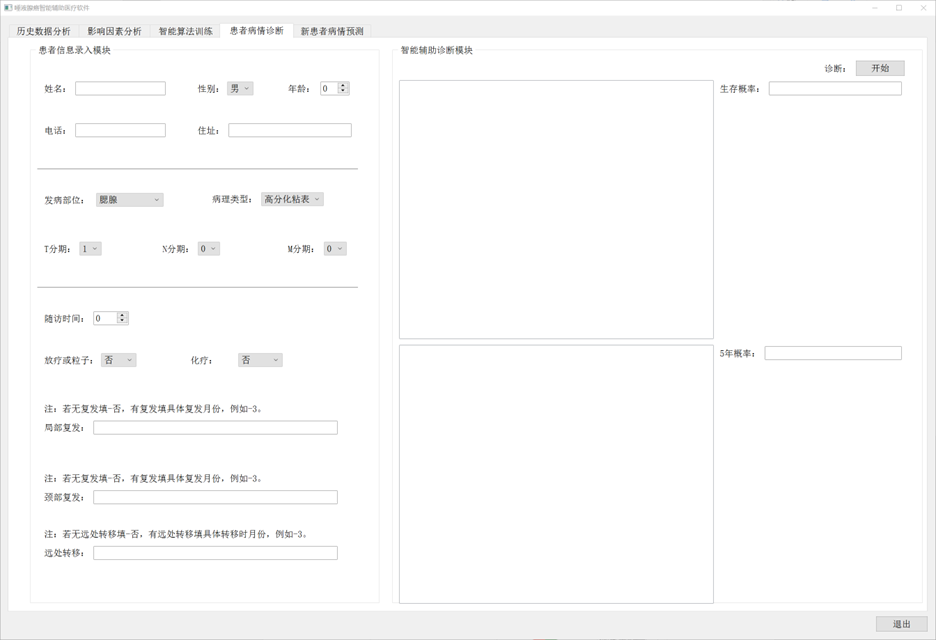
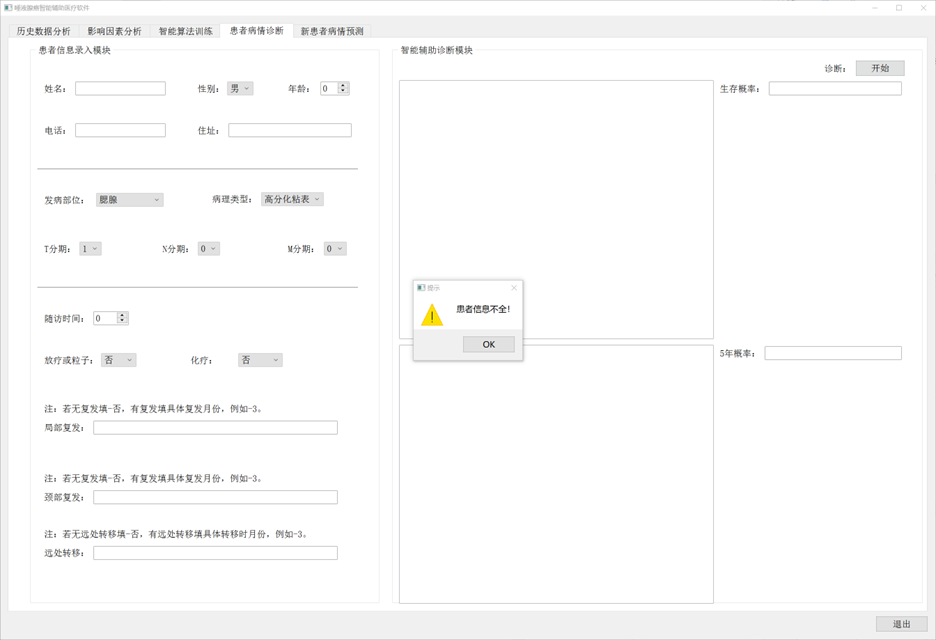
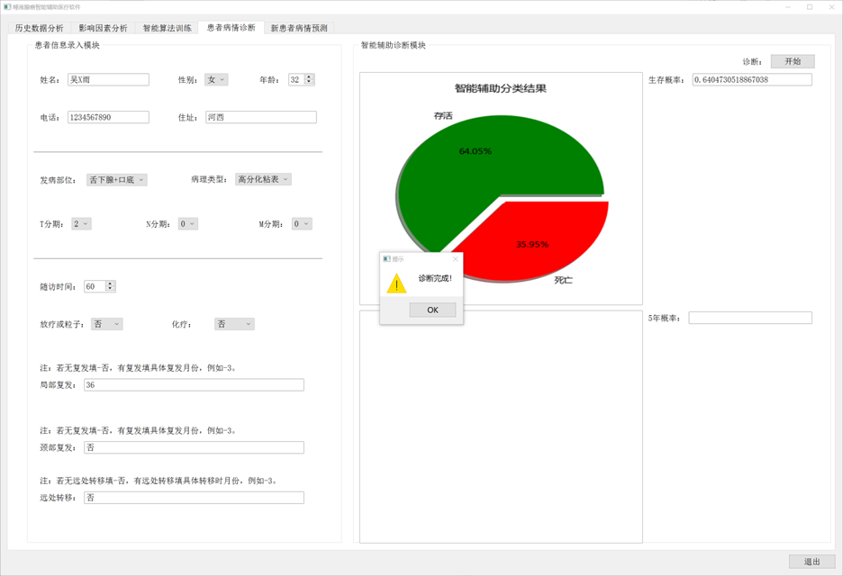
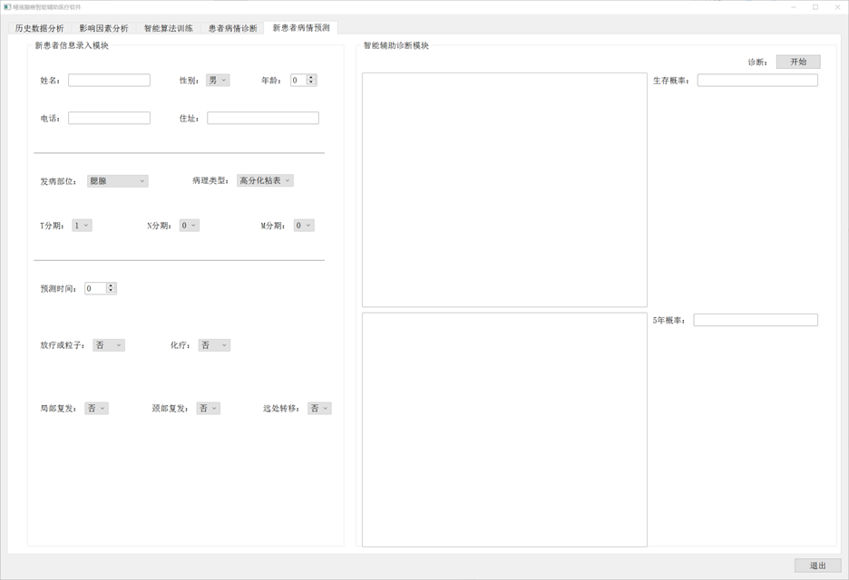
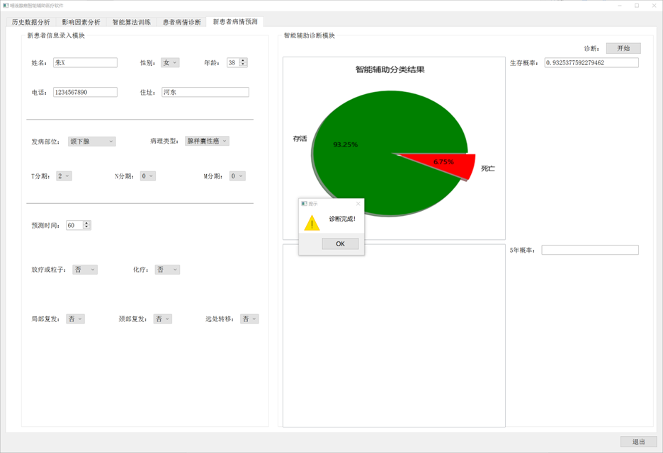

# Prognostic prediction model for salivary gland carcinoma based on machine learning
Intelligent Assisted Medical Software for Salivary Gland Cancer

## Login Interface
Operation Process: (Username is in English only)

Upon running the software, the login interface appears. Enter the username and corresponding password, then click 'Login' to access the main program.

If the entered username or password is incorrect, a warning dialog will appear, stating, "This user does not exist. Please re-enter or create a new user!"

To create a new user, click the "Create" button. A new window will appear, as follows. Enter the desired username and login password, click "Create," wait for the confirmation prompt, and then click "Exit" to return to the login interface for logging in again.

Source Code Flow:

In the main program GUI.py, the GUI_Log class is responsible for invoking the login interface. Usernames and passwords are stored in the "user_info.csv" file in Excel format under the "./GUI/data/" directory. If there is a need to create a new user, the GUI_Create_Account class is invoked.

## Main Interface:
The main interface includes "Patient Condition Diagnosis" and "New Patient Condition Prediction" sections.

### "Patient Condition Diagnosis" section

The left side of the interface involves entering relevant patient information. If there is missing information, a prompt dialog will appear. On the right side, the system predicts whether the patient can survive. If the probability of survival is greater than 0.5, further prediction stages are not conducted. If the prediction is less than 0.5, a detailed prediction of the survival time interval will be carried out.

Firstly, input patient information on the left side. If there is missing information, a prompt will appear to complete the details.

After inputting the information, click the "Start" button on the right to initiate the diagnosis of the selected area. If the diagnostic result indicates a patient survival probability less than 0.5, the second stage of diagnosis is initiated, as follows:

Furthermore, patient information and diagnostic results will be stored in a new Excel format at ./data/raw_data/patient.xlsx.

### "New Patient Condition Prediction" section

The interface involves inputting patient information on the left side. If there is missing information, a prompt will appear. On the right side, the system predicts whether the patient can ultimately survive. If the survival probability is greater than 0.5, no further prediction stages are performed. If the prediction is less than 0.5, a detailed prediction of the survival time interval is conducted.

After inputting the information, click the "Start" button on the right to initiate the diagnosis of the selected area. If the diagnostic result indicates a patient survival probability less than 0.5, the second stage of diagnosis is initiated, as follows:

Additionally, patient information and diagnostic results will be stored in a new Excel format at ./data/raw_data/new_patient.xlsx.
